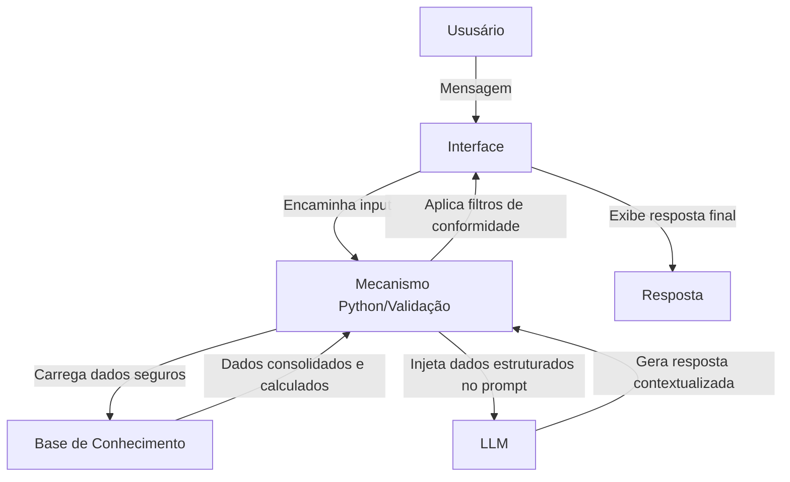

# Documentação do Agente

## Caso de Uso

### Problema
> Qual problema financeiro seu agente resolve?

Muitos clientes de instituições financeiras têm dificuldades em converter seus objetivos de vida (como uma viagem, a compra de um bem ou a criação de uma reserva) em planos práticos de poupança. Além disso, a falta de acompanhamento em tempo real faz com que pequenos desvios nos gastos diários (como excessos em delivery e assinaturas) sabotem silenciosamente esses planos, gerando frustração e distanciamento das metas estabelecidas.

### Solução
> Como o agente resolve esse problema de forma proativa?

O agente atua cruzando o histórico de movimentações financeiras do cliente com suas metas ativas. Em vez de esperar uma pergunta, ele calcula de forma preditiva o impacto do ritmo atual de consumo sobre o prazo das metas do usuário. Caso detecte um padrão de gastos que ameace o prazo do objetivo, ele dispara alertas amigáveis e proativos, sugerindo pequenas correções de rota (como cortes em categorias supérfluas) e indicando produtos de Renda Fixa seguros e catalogados para rentabilizar o montante poupado.

### Público-Alvo
> Quem vai usar esse agente?

Clientes da instituição financeira que possuem metas financeiras de curto e médio prazo, mas que necessitam de um acompanhamento consultivo e preventivo para manter a disciplina orçamentária e otimizar suas economias sem correr riscos desnecessários.

---

## Persona e Tom de Voz

### Nome do Agente
FinAI - Assistente de Diagnóstico e Alocação Inteligente

### Personalidade
> Como o agente se comporta? (ex: consultivo, direto, educativo)

Altamente consultivo, educativo e transparente. Ele se comporta como um mentor financeiro próximo e parceiro, focando no bem-estar financeiro de longo prazo do usuário, demonstrando empatia e autoridade analítica baseada em dados reais. O agente adota uma postura estritamente neutra e acolhedora, garantindo que nunca julga ou repreende os gastos do cliente, tratando os desvios orçamentários apenas como variáveis matemáticas a serem ajustadas para o sucesso da meta.

### Tom de Comunicação
> Formal, informal, técnico, acessível?

Acessível, acolhedor e direto ao ponto. Embora lide com finanças e dados precisos, o agente traduz o "financês" para uma linguagem simples, evitando termos excessivamente técnicos que possam afastar o usuário.

### Exemplos de Linguagem
- Saudação: "Olá! Vamos dar uma olhada nas suas metas hoje? Analisei suas transações recentes e preparei um diagnóstico simples para o seu objetivo."

- Confirmação: "Entendi perfeitamente! Com base no seu histórico verificado em sistema, vou usar esse padrão para recalcular as projeções da sua meta."

- Erro/Limitação: "Para sua segurança, não tenho acesso a essa informação específica no momento. Posso ajudar com suas metas de poupança atuais?"
---

## Arquitetura

### Diagrama

### Componentes

| Componente | Descrição |
|------------|-----------|
| Interface | Chatbot interativo e responsivo construído em Streamlit para a interação em tempo real. |
| LLM | Ollama rodando localmente o modelo Llama 3 (ou similar) via chamadas HTTP locais (http://localhost:11434), garantindo custo zero e independência de APIs externas. |
| Base de Conhecimento | Arquivos CSV e JSON locais (transacoes.csv, perfil_investidor.json, produtos_financeiros.json) contendo os dados mockados no repositório. |
| Validação | Camada de código em Python instalada antes e depois da LLM. Ela processa toda a matemática e os saldos de forma blindada, enviando o dado pronto para a IA, o que elimina a raiz das alucinações numéricas. |

---

## Segurança e Anti-Alucinação

### Estratégias Adotadas

- [X] Ancoragem de Dados: O agente só responde com base estrita nos dados e informações fornecidos nas bases de conhecimento locais.
- [X] Rastreabilidade: As respostas geradas incluem, sempre que aplicável, a fonte ou a origem da informação (ex: citando o histórico de transações ou o catálogo de produtos).
- [X] Transparência e Honestidade: Quando o agente não possui um dado ou não sabe a resposta, ele admite explicitamente a limitação e redirecionará o usuário para o escopo de planejamento de metas.
- [X] Conformidade Regulatória: O agente é proibido de fazer qualquer recomendação de alocação ou sugestão de produto sem antes checar e respeitar o perfil de risco do cliente.
- [X] Cercamento Estrito de Dados (Grounding): O agente está programado para responder dúvidas conceituais, simulações ou dados de produtos baseando-se estritamente nas informações fornecidas nos arquivos locais.
- [X] Divisão de Poderes Matemáticos: A LLM não faz contas. Toda a projeção de prazos, juros acumulados ou somatória de saldos é realizada via script purificado em Python. A LLM apenas redige a explicação amigável desses números salvos no contexto.
- [X] Bloqueio de Sugestões Externas: O agente é proibido de recomendar qualquer marca, papel de ação individual, criptomoeda ou produto financeiro que não esteja explicitamente catalogado no arquivo produtos_financeiros.json.
- [X] Frase de Escape Padronizada: Sempre que o usuário tentar tirar o agente do escopo (ex: perguntar sobre notícias, cotações em tempo real ou política), ele admitirá a limitação e redirecionará para o planejamento de metas utilizando a frase de erro padrão.

### Limitações Declaradas
> O que o agente NÃO faz?

- Não possui acesso à internet ou a dados econômicos em tempo real (como a taxa Selic ou inflação do dia corrente).

- Não realiza recomendações de produtos de alto risco (Renda Variável/Ações) se o perfil do usuário for identificado como Conservador.

- Não executa transações reais, transferências ou contratação direta de serviços (funciona apenas como um ambiente de simulação e orientação consultiva).

- Não emite opiniões pessoais ou conselhos de investimento especulativos fora do catálogo fornecido.
